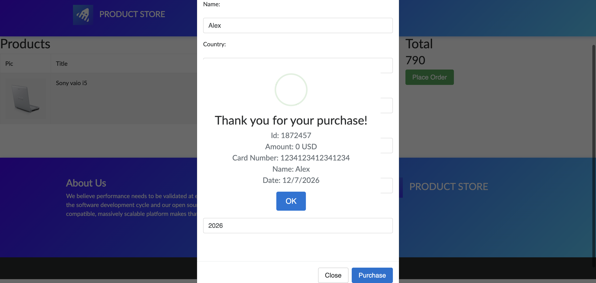
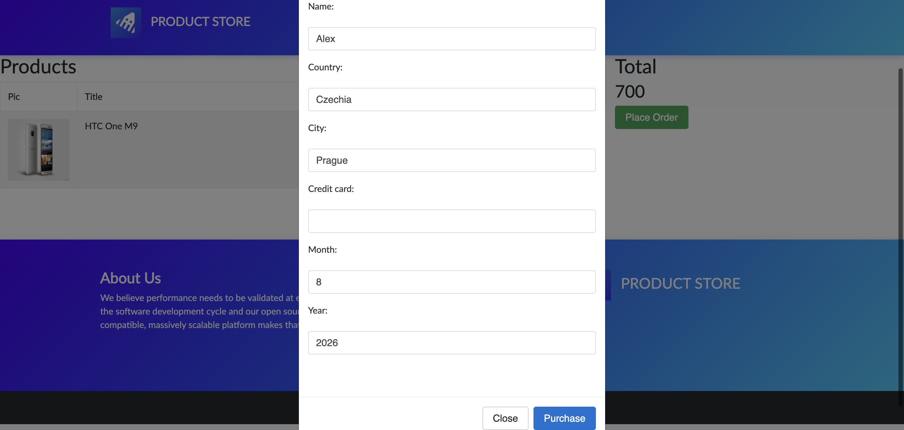
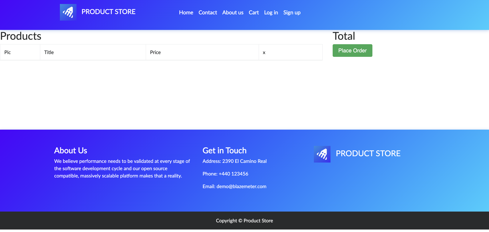

# 🛒 DemoBlaze Automation Test Suite

This directory contains the end-to-end automation test suite for the DemoBlaze e-commerce platform.

---

---

## 📸 Test Execution Screenshots

|        Purchase Confirmation        |             Invalid Checkout Validation             |            Cart Flow             |
|:-----------------------------------:|:---------------------------------------------------:|:--------------------------------:|
|  |  |  |

---

## 📁 Directory Structure
* `utils.py` - Core helper functions for UI navigation, data extraction, Stripe API integration, and SQLite database recording.
* `config.py` - Environment configuration, base URLs, element selectors, and DB paths.
* `test_ecommerce_flow.py` - UI tests for product selection, cart management, and item removal assertions.
* `test_payment_checkout.py` - UI validation tests for order checkout modal and missing card info popups.
* `test_full_payment_integration.py` - 3-layer integration test (UI price extraction -> Stripe charge -> SQLite verification).
* `test_payment_error_handling.py` - Negative flow test simulating declined card handling via Stripe API and database logging.

---

## 🚀 How to Run Tests

Run the full DemoBlaze test suite from the `days-91-180` root directory:

```bash
pytest demoblaze -v -s