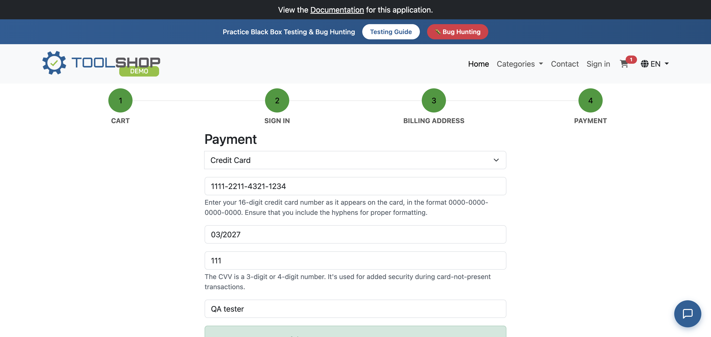

# 🧰 PracticeSoftwareTesting (ToolShop Demo) Suite

This directory contains automated end-to-end checkout flow tests for the PracticeSoftwareTesting platform.


---

## 📸 Automated Checkout Verification


---

## 📁 Directory Structure
* `utils.py` - Modular UI automation helper functions for guest checkout steps.
* `config.py` - Selectors, XPath locators, base URLs, and test data dictionary.
* `test_checkout.py` - Complete E2E guest purchase flow test.

---

## 🚀 How to Run Tests

Run this suite from the `days-91-180` directory:

```bash
pytest practicesoftwaretesting -v -s